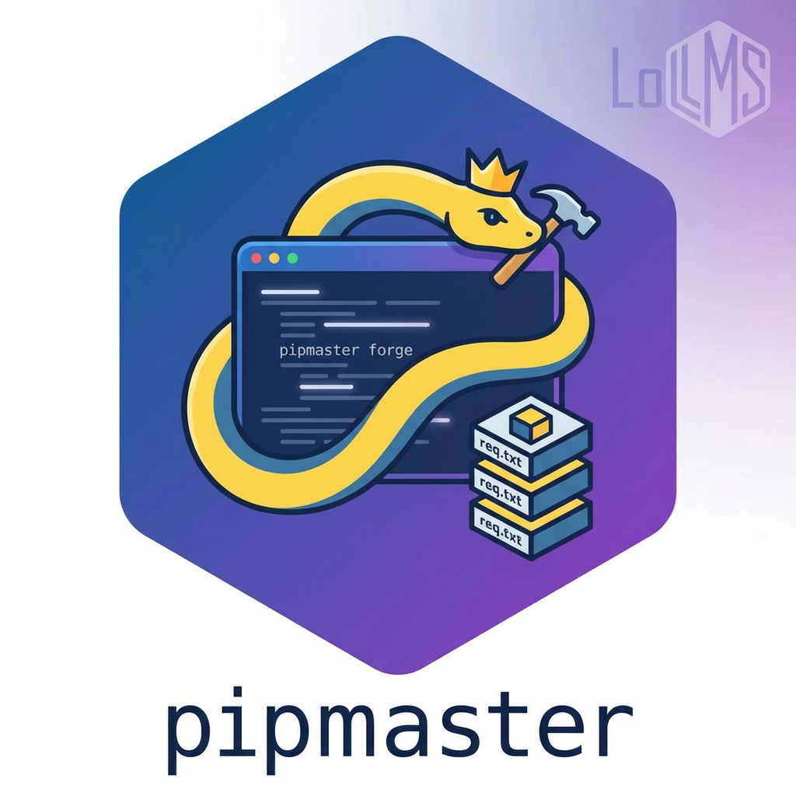

.. _index:

####################################
 PipMaster: Python Package Toolkit
####################################

   *Programmatic Package Management for Python*

---

**Tired of scripting complex ``subprocess`` calls to manage Python packages?**

`pipmaster` provides a clean, robust, and feature-rich Python API to interact with package managers like `pip`. It allows you to seamlessly **install, update, check, uninstall, and manage dependencies** programmatically, both within the current environment and **specifically targeting other Python virtual environments**.

Whether you're building application setup routines, automating testing environments, managing plugins, or creating development tools, `pipmaster` simplifies your package management workflows.

**Key Features:**

*   ✅ **Programmatic Control:** A clear Python interface for `pip` operations.
*   🎯 **Environment Targeting:** Manage packages in any specified Python environment.
*   🔄 **Flexible Installation:** Handle single/multiple packages, specific versions, requirements files, and editable installs.
*   🔍 **Conditional Logic:** Install packages only if missing or if version requirements aren't met (:py:func:`~pipmaster.package_manager.install_if_missing`).
*   ⚙️ **Status Checks:** Reliably check if packages are installed (:py:func:`~pipmaster.package_manager.is_installed`), get versions (:py:func:`~pipmaster.package_manager.get_installed_version`), and verify version compatibility (:py:func:`~pipmaster.package_manager.is_version_compatible`).
*   🛡️ **Vulnerability Scanning:** Integrate `pip-audit` checks into your workflows (:py:func:`~pipmaster.package_manager.check_vulnerabilities`).
*   ⚡ **Asynchronous API:** Non-blocking operations for async applications (:py:mod:`pipmaster.async_package_manager`).
*   🧪 **Dry Run Mode:** Simulate commands without making changes to the environment.
*   🚀 **Modern & Robust:** Uses standard libraries like ``importlib.metadata`` and ``packaging``.
*   🧩 **Extensible:** Designed with future support for other backends (like `uv`, `conda`) in mind.

**Core Use Cases:**

*   **Application Bootstrapping:** Ensure necessary dependencies are present when your application starts.
*   **Automated Testing:** Set up specific package versions in test environments.
*   **Plugin Systems:** Dynamically install required packages for plugins.
*   **Development Tooling:** Build scripts that manage project dependencies.
*   **CI/CD Pipelines:** Integrate programmatic package management into your build and deployment processes.

**Quick Links:**

*   `GitHub Repository <https://github.com/ParisNeo/pipmaster>`_
*   `PyPI Package <https://pypi.org/project/pipmaster/>`_
*   `Issue Tracker <https://github.com/ParisNeo/pipmaster/issues>`_

Ready to simplify your package management?
==========================================

.. toctree::
   :maxdepth: 2
   :caption: Getting Started

   installation
   getting_started

Explore the details:
====================

.. toctree::
   :maxdepth: 2
   :caption: User Guide

   user_guide/index

Full API details:
=================

.. toctree::
   :maxdepth: 2
   :caption: API Reference

   api/index

Project Information:
====================

.. toctree::
   :maxdepth: 1
   :caption: Project Info

   changelog
   contributing
   LICENSE <../LICENSE>

Indices and Tables
==================

*   :ref:`genindex`
*   :ref:`modindex`
*   :ref:`search`